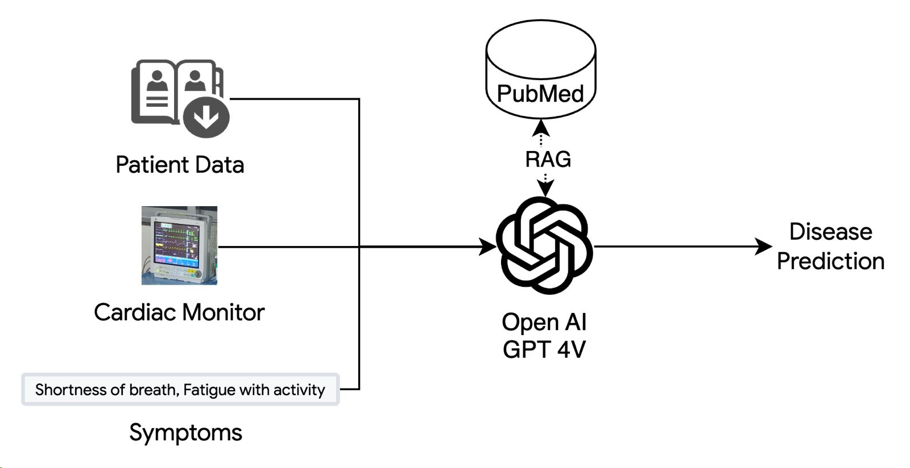
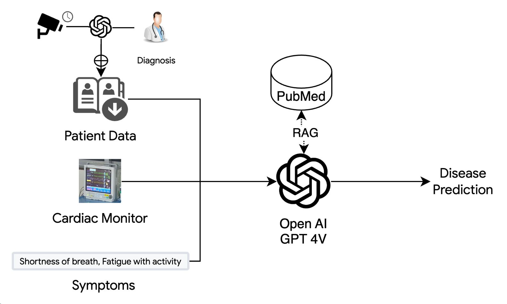

# Multi Modal Monkey 
Cardiac assistant for monitoring and diagnosis of heart diseases.

 ## Pipeline

We employ a multi-modal approach to extract vitals from images of cardiac monitors captured by CCTV cameras and the symptoms of the patient. The vitals are then used to predict the probability of the patient.

Patient history, medical transcripts and temporal data of patient's vitals are used to improve the prec

